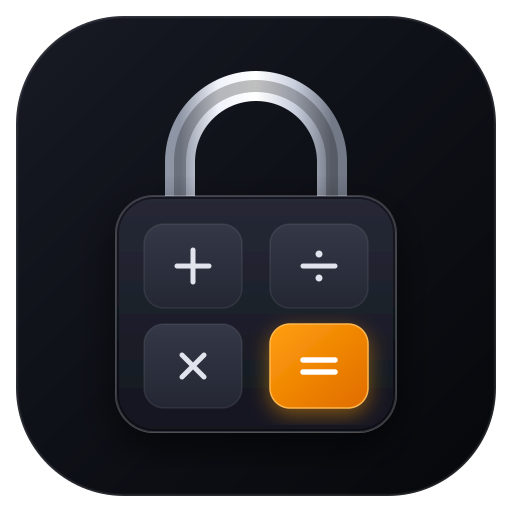

<p align="center">
  
</p>

<h1 align="center">Calculator Vault</h1>

<p align="center">
  <strong>A client-side encrypted file vault hidden inside a fully working calculator. No backend, no dependencies, works offline.</strong>
</p>

<p align="center">
  
  
  
  
  
  
</p>

---

## Table of Contents

1. [Overview](#overview)
2. [Features](#features)
3. [How It Works](#how-it-works)
4. [Cryptographic Architecture](#cryptographic-architecture)
5. [Storage Model](#storage-model)
6. [Security Behaviors](#security-behaviors)
7. [Calculation Engine](#calculation-engine)
8. [Keyboard Shortcuts](#keyboard-shortcuts)
9. [Project Structure](#project-structure)
10. [Running Locally](#running-locally)
11. [Deploying to GitHub Pages](#deploying-to-github-pages)
12. [Browser Support](#browser-support)
13. [Known Limitations](#known-limitations)
14. [How This Project Was Built](#how-this-project-was-built)
15. [Roadmap](#roadmap)
16. [License](#license)

---

## Overview

Calculator Vault is a privacy-focused web app with two faces:

1. **The calculator.** A polished desktop-style calculator with Basic, Scientific, Programmer, Unit Converter and Geometry modes, plus a calculation history.
2. **The vault.** An encrypted local file store. Typing your secret numeric passcode on the keypad and pressing `=` switches the screen from the calculator to a gallery where you can add, preview, export and delete files.

Everything runs inside your browser using the standard **Web Crypto API** and **IndexedDB**. Files are never uploaded anywhere, there is no server component, and there are no third-party libraries. After the first load the app keeps working with the network switched off.

---

## Features

### Calculator

| Mode | What it offers |
| :--- | :--- |
| **Basic** | Standard arithmetic (`+`, `−`, `×`, `÷`, `%`, `±`), memory keys, live display, history tape |
| **Scientific** | Trigonometric functions (`sin`, `cos`, `tan`), their inverses, hyperbolic functions and inverses, `ln`, `log` (base 10), powers, `√`, factorial `x!`, constants (`π`, `e`, `φ`), DEG/RAD toggle, 2nd-function toggle |
| **Programmer** | Live HEX / DEC / OCT / BIN display, bitwise operations (AND, OR, XOR, NOT, MOD, shifts), selectable word sizes (8, 16, 32, 64-bit) using `BigInt` |
| **Unit Converter** | Length, area, volume, mass, temperature, speed, time, data, pressure and energy, with a swap button and an "insert into calculator" button |
| **Geometry** | Formulas for circle, rectangle, triangle, trapezoid, ellipse, box, cylinder, sphere, cone and pyramid (area, perimeter, surface area, volume as applicable) |

Other calculator details:
- Calculation history (the most recent 20 entries) with click-to-recall and a clear button
- Light, dark and automatic (follows system) themes
- Keyboard input support
- Key-click sounds generated in real time with the Web Audio API (no audio files), which can be switched off in settings
- Division by zero and invalid input produce clear errors instead of `Infinity` or `NaN`

### Vault

- **First-run setup.** On first launch the app asks you to choose a passcode (entered twice). The vault is created locally.
- **Stealth unlock.** Type your passcode (6 to 12 digits) on the keypad and press `=`. Anything else is treated as a normal calculation.
- **Adding files.** Choose files with the file picker or drag and drop them onto the vault area.
- **Gallery with categories.** Files are sorted into All, Photos, Videos, Audio, PDFs, Documents and Other.
- **Previews.** Images, video, audio, PDFs and text open in an in-app lightbox. Other file types can be exported/downloaded and opened in a native app.
- **Export and delete.** Download a decrypted copy of a single file, or delete files (including several at once).
- **Quick Hide.** A button (and the `Esc` key) instantly locks the vault and returns to the calculator.
- **Settings.** Theme, key sounds, auto-lock timeout (30 seconds, 1, 5 or 15 minutes; default 1 minute), change passcode, and an emergency wipe that deletes all vault data, keys and settings.

---

## How It Works

```
 First launch                          Every later visit
 ────────────                          ─────────────────
 Choose passcode (twice)               Calculator shown
        │                                     │
        ▼                                     ▼
 Salt + random master key              Type passcode, press "="
 generated, master key wrapped                │
 and stored in IndexedDB                      ▼
        │                              Derive key from passcode,
        ▼                              try to unwrap master key
 Calculator shown                             │
                                  ┌───────────┴───────────┐
                                  ▼                       ▼
                            Unwrap works             Unwrap fails
                            (GCM tag valid)          (wrong passcode)
                                  │                       │
                                  ▼                       ▼
                           Vault opens           Treated as a normal
                                                 number / calculation
```

A wrong passcode is detected by AES-GCM authentication: if the key derived from the typed digits cannot decrypt the wrapped master key, the unlock simply fails and the calculator behaves normally.

---

## Cryptographic Architecture

Calculator Vault uses **envelope encryption** built on `window.crypto.subtle`.

```
Passcode (6–12 digits) ──> PBKDF2 (HMAC-SHA-256, 600,000 iterations, 16-byte random salt)
                                          │
                                          ▼
                             Key Encryption Key (KEK, AES-256-GCM)
                                          │
                  ┌───────────────────────┴───────────────────────┐
                  ▼                                               ▼
        Wrap master key (setup)                         Unwrap master key (unlock)
                  │                                               │
                  ▼                                               ▼
     Wrapped master key stored in                   Master key (AES-256-GCM,
     IndexedDB header record                        non-extractable CryptoKey)
                                                                  │
                                         ┌────────────────────────┴───────────────────┐
                                         ▼                                            ▼
                               Encrypt file data                           Encrypt file metadata
                               (random 12-byte IV per file)                (name, type, size, etc.)
```

1. **Key derivation.** A random 16-byte salt is created with `crypto.getRandomValues()`. The passcode is stretched with PBKDF2 (HMAC-SHA-256, 600,000 iterations) into a 256-bit key-encryption key.
2. **Master key wrapping.** A random 256-bit AES-GCM master key encrypts all user data. The master key is itself encrypted with the KEK and stored in IndexedDB. Because of this layer, changing the passcode only requires re-wrapping the master key, not re-encrypting every file.
3. **Authenticated encryption.** Files are encrypted with AES-256-GCM, each with its own freshly generated 12-byte IV. GCM authenticates the data, so tampered ciphertext is rejected on decryption.
4. **Encrypted metadata.** File names, types and sizes are encrypted too, with the same master key, so they are not readable from the raw database.
5. **Key handling.** The raw master key bytes are zeroed (`.fill(0)`) right after being imported as a **non-extractable** `CryptoKey`. Locking the vault drops the key reference.

---

## Storage Model

All persistent data is stored in the browser's IndexedDB. There are two object stores:

| Store | Key | Value | Contents |
| :--- | :--- | :--- | :--- |
| `h` (header) | `'h'` | `{ salt, it, w, createdAt }` | PBKDF2 salt, iteration count, and the KEK-wrapped master key |
| `h` (header) | `'settings'` | `{ theme, sound, idleTimeout, discreetTitle }` | User preferences (stored **unencrypted**) |
| `f` (files) | file id | `{ id, m, d }` | `m` = encrypted metadata, `d` = encrypted file data (each with its own IV) |

---

## Security Behaviors

- **Auto-lock on inactivity.** The vault locks after the configured idle timeout.
- **Lock on tab switch.** Switching to another browser tab or window (`visibilitychange`) locks the vault.
- **Quick Hide.** The `Esc` key (while in the vault, unless a lightbox or settings dialog is open) or the Quick Hide button locks instantly.
- **In-memory previews.** Decrypted files are rendered from in-memory Blob URLs and are not written to disk by the app. Exporting a file downloads a decrypted copy.
- **No network access needed.** There are no analytics, trackers or remote requests in the app.
- **Emergency wipe.** Clears the header, all encrypted files and settings from IndexedDB after a confirmation prompt.

---

## Calculation Engine

Expressions are evaluated by a custom **recursive descent parser**. The code never uses `eval()` or the `Function` constructor.

Input is first tokenized and checked, so anything the tokenizer does not recognize is rejected as a syntax error. The grammar, from lowest to highest precedence:

1. **Addition and subtraction** (`+`, `-`)
2. **Multiplication and division** (`*`, `/`). Dividing by zero throws an explicit error.
3. **Unary sign** (`+`, `-`)
4. **Exponentiation** (`^`)
5. **Postfix operators**: factorial (`!`) and percent (`%`, divides by 100)
6. **Primary values**: numbers, parentheses, constants (`pi`, `e`, `phi`) and function calls (`sin`, `asin`, `sinh`, `asinh`, `ln`, `log`, `sqrt`, and others)

Functions validate their domain (for example `asin` outside -1 to 1 and `log` of a non-positive number produce errors), and common exact degree values such as `sin(180)` and `cos(90)` are corrected so they return clean results. Programmer mode uses `BigInt` arithmetic for bitwise operations.

---

## Keyboard Shortcuts

| Key | Context | Action |
| :--- | :--- | :--- |
| `0`–`9`, `.` | Calculator | Enter digits and decimal point |
| `A`–`F` | Calculator | Hex digits (useful in Programmer mode) |
| `+`, `-`, `*`, `/` | Calculator | Arithmetic operators |
| `^`, `!`, `%`, `(`, `)` | Calculator | Power, factorial, percent, parentheses |
| `Enter` or `=` | Calculator | Evaluate (or unlock the vault if the digits match the passcode) |
| `Backspace` | Calculator | Delete the last character |
| `Esc` | Calculator | Clear (AC) |
| `Esc` | Vault | Quick Hide: lock and return to the calculator |
| `Esc` | Lightbox | Close the preview |

---

## Project Structure

```
├── index.html                  # Entry point and view containers
├── server.py                   # Small local dev server (correct MIME types, security headers)
├── LICENSE
├── .gitignore
├── assets/
│   ├── logo.svg
│   └── favicon.svg
├── css/
│   ├── theme.css               # Design tokens, light/dark colors
│   ├── main.css                # Base layout, typography, modals
│   ├── calculator.css          # Keypad, display, converter and geometry panels
│   └── vault.css               # Gallery, dropzone, lightbox, controls
└── js/
    ├── app.js                  # App lifecycle, setup/unlock/lock, idle timer, passcode change
    ├── core/
    │   ├── crypto.js           # Web Crypto wrapper (PBKDF2, AES-GCM, key wrapping)
    │   ├── storage.js          # Promise-based IndexedDB access
    │   ├── calc-engine.js      # Tokenizer and recursive descent evaluator
    │   ├── converter-engine.js # Unit categories and conversion math
    │   └── geometry-engine.js  # 2D and 3D shape formulas
    └── ui/
        ├── calculator-ui.js    # Keypad handling, display, history, mode switching
        ├── vault-ui.js         # Dropzone, gallery, categories, thumbnails
        ├── modal-manager.js    # Settings, lightbox, dialogs, toasts
        ├── theme-manager.js    # Light / dark / auto theme
        └── sound-effects.js    # Synthesized key-click sounds
```

---

## Running Locally

The project uses ES modules, so it has to be served over HTTP. Opening `index.html` directly with `file://` will not work.

**Option 1: Python (included)**
```bash
python3 server.py
```
Then open <http://localhost:8080>. If the port is busy, the server tries the next ones.

**Option 2: Node.js**
```bash
npx serve .
```

**Option 3: VS Code**
Use the Live Server extension and choose "Open with Live Server" on `index.html`.

---

## Deploying to GitHub Pages

1. Push the repository to GitHub.
2. In the repository, open **Settings → Pages**.
3. Under **Branch**, choose `main` and the `/ (root)` folder, then save.
4. After a minute or two the app is available at your GitHub Pages URL over HTTPS (HTTPS is also required for the Web Crypto API on non-localhost origins).

---

## Browser Support

A modern browser with support for ES modules, the Web Crypto API, IndexedDB and the Web Audio API is required. Current versions of Chrome, Edge, Firefox and Safari should work. The app has mainly been tried in one environment, so please open an issue if you find a browser-specific problem.

---

## Known Limitations

Please read this before storing anything important.

- **The passcode is numeric and short (6 to 12 digits).** A 6-digit passcode has only 1,000,000 possibilities. If someone obtains a copy of your browser's IndexedDB data, they can brute-force the passcode offline, even with 600,000 PBKDF2 rounds. Use a longer passcode, and keep in mind that this is the weakest link in the design.
- **No independent security review.** The app uses standard Web Crypto primitives, but the project as a whole has not been audited.
- **Browser-level protection only.** It does not protect against malware, malicious browser extensions, or someone using your unlocked device.
- **Decrypted data is in memory while unlocked**, and exported files are saved decrypted.
- **Settings are stored unencrypted** (theme, sound, auto-lock timeout).
- **Data lives in this browser only.** Clearing site data, switching browsers or devices, or using private browsing means the vault is gone or unreachable. A forgotten passcode cannot be recovered.
- **No full-vault backup or restore yet.** Individual files can be exported, but there is no encrypted backup of the whole vault.
- **The app is a disguise, not a guarantee.** The calculator front hides that a vault exists from casual viewers, but the source code and IndexedDB database are visible to anyone who looks.

---

## How This Project Was Built

Idea, feature set and project direction: Gopal Kumar Singh.

AI assistance: I used an AI assistant (Claude) to help with the security and cryptography layer, the IndexedDB storage layer, and a full rewrite of the program. I tested and reviewed the result myself. Through this project I learned the basics of web security: how a passcode is turned into an encryption key with PBKDF2, why envelope encryption (a wrapped master key) is used, how AES-GCM encrypts and authenticates data, and why short numeric passcodes are a weakness (see [Known Limitations](#known-limitations)).

I am saying this openly because AI tools are part of how I learn and build, and I would rather be transparent about it.

---

## Roadmap

- Encrypted full-vault backup and restore
- Longer alphanumeric passphrase option
- Stronger key derivation (for example Argon2 through WebAssembly)
- Encrypt the settings record
- Automated tests for the crypto and calculator engines

---

## License

This project is licensed under the [MIT License](LICENSE).
